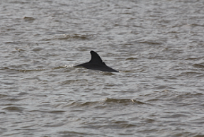

# finFindR
finFindR is an R and c++ based library for doing photo recognition on dolphins.

Currently, the finFindR app is in beta which you can download using the link to the setup  file bellow.

The App provides an interface to the core library functionality, Including automated image cropping, image tracing and catalogue matching using a tripletLoss network trained in mxnet.

Download link: 
https://github.com/haimeh/finFindR/releases

Raw images collected in the field are prepped for cataloging in two steps.
A neural network isolates fins from the image and selects a region that surrounds each contiguous region of activation \n

 \n
Each selection is then cropped and saved \n
 \n \n

Once the image is cropped it is prepared for matching by further cropping the image to isolate the trailing edge. \n
The matching process begins with an edge tracing algorithm programmed in finFindR which, \n \n

from the crop, the enhanced canny-edges(white) are calculated and the optimal-trace(red) is extracted. \n

This optimal path is used as a guide to extract the input for the neural network.
The input takes the form of 200 samples from along the optimal path.
Each sample consists of a ring around the sample position where the ring is composed of 16 subsamples of the image values. \n
 \n
These measurements quantify overall shape and details such as knicks. The matching algorithm consisted of a deep convolutional neural network
based on the ResNet architecture, which generated a large-margin nearest neighbor metric. The
network was trained using a k-neighbors soft-triplet loss objective.
The neural network defines a mapping from the raw input data to an embedding where
the distances between instances of a given individual are closer to each other than to instances of
other individuals. The nearest neighbor metric produced by the neural network discriminates and
matches dorsal fins by computing a “distance” on the embedding from the characteristics of one
fin to characteristics of other fins. Shorter “distances” represent fin pairs with similar nick and
notch characteristics, and therefore express putative matches.